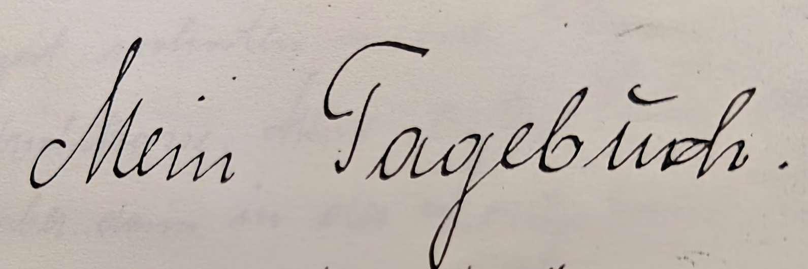

# Autobiography of Helene Schaarschmidt, born 1903 in Plauen, Germany

This repository serves the purpose of transcribing and translating Helene Martha Schaarschmidt's autobiography. She was born in 1903 in Plauen and, at 55, decided to summarize her life and her experience of living through two World Wars in a blended style of biography and diary. 

## Background

I received a photocopied version of "Mein Tagebuch" from my grandmother, Helene's daughter, and currently 88 years old. I scanned the full book of 76 pages and slowly work on transcribing it first in German, and then translating it into English. Given the context of her life in war-ridden Germany in the first half of the 20th century, her biography has some historical value for anyone interested in reading a first-hand report on living as a common German citizen during that period.
This book is published under an open license (CC0 1.0).

## How to contribute

There are two main ways to contribute:

1. If you can read old German handwriting, you can download the <a href="Mein%20Tagebuch__Helene%20Martha%20Schaarschmidt.pdf">scanned PDF file</a>
 and transcribe the text into the LaTeX file. This is done on a per-page basis, as indicated in the .tex document.
2. The currently transcribed text can be translated into an English TeX file.
